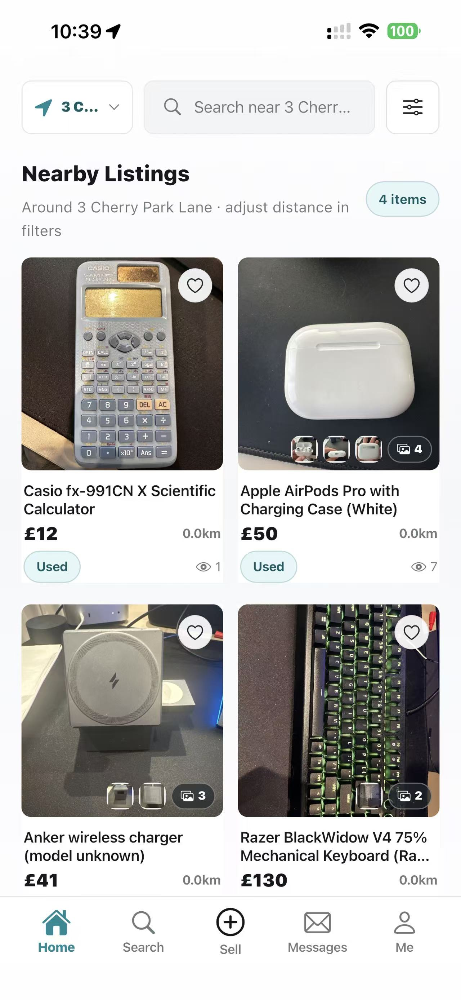
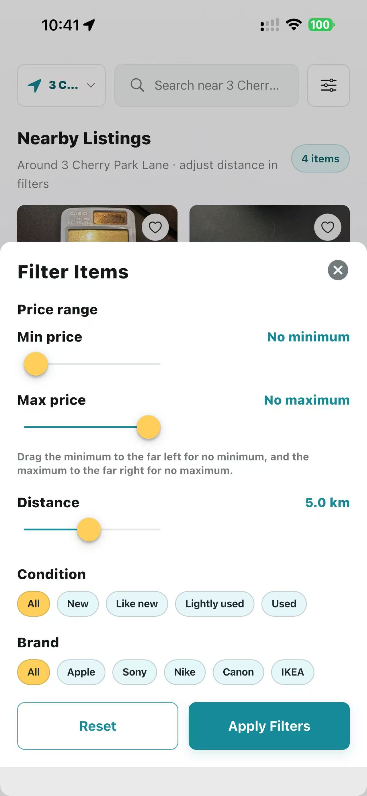
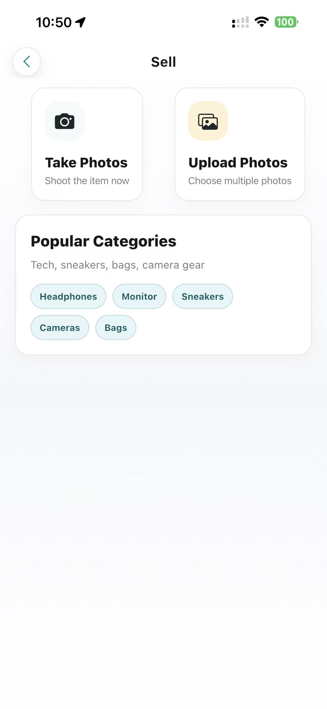
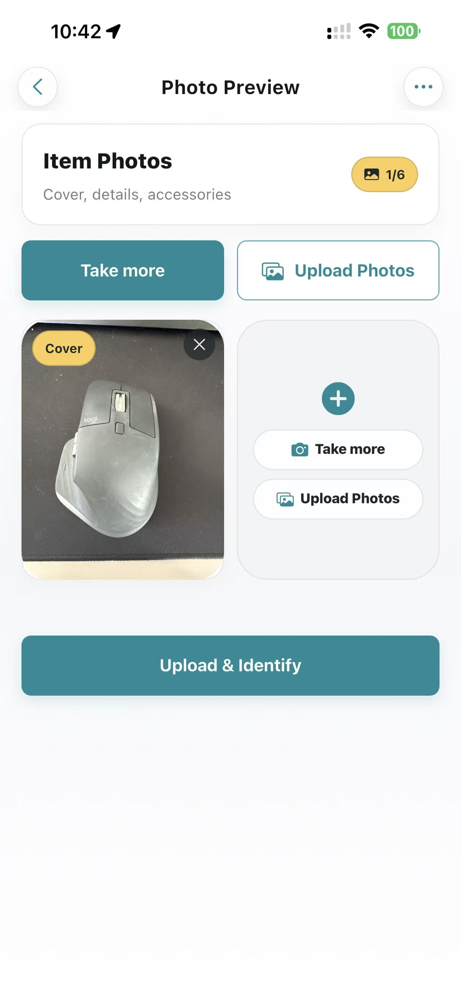
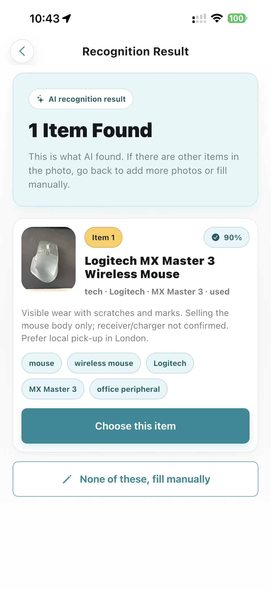
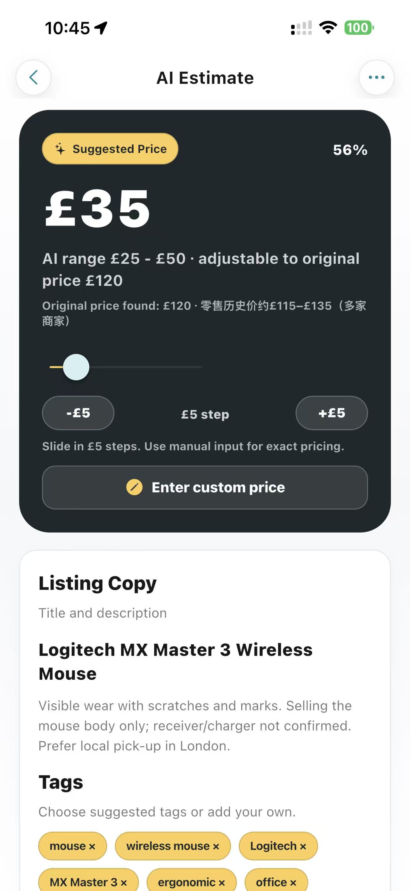
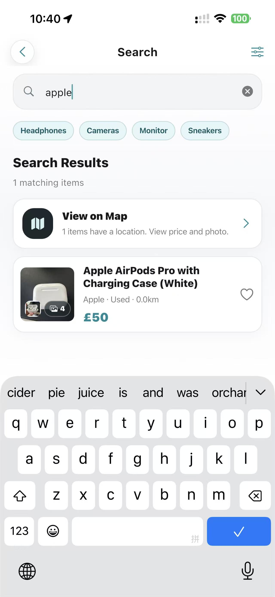
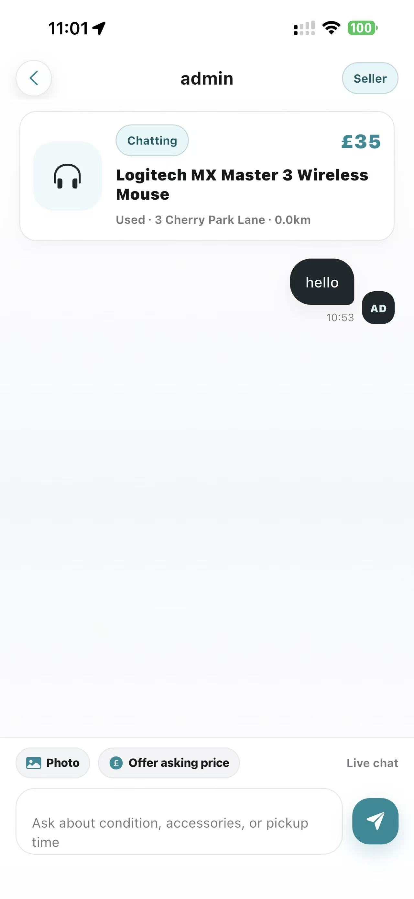
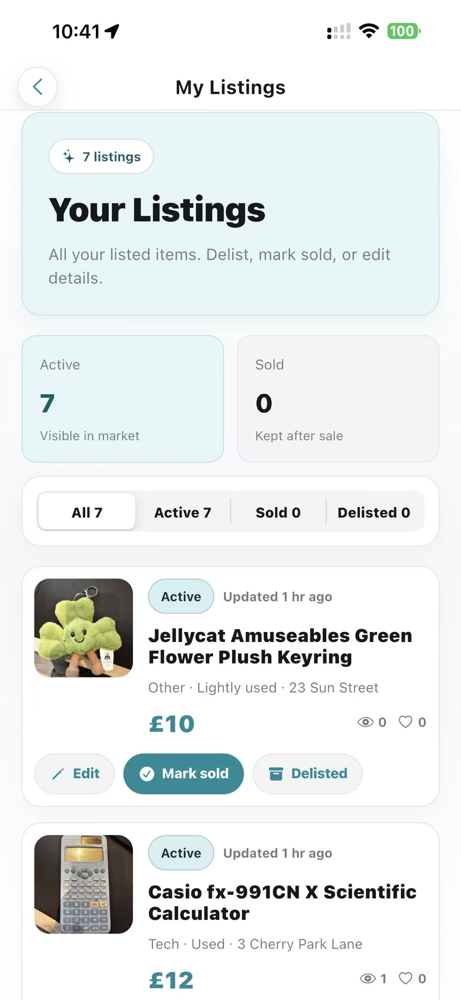

<p align="center">
  
</p>

<h1 align="center">SecondNest</h1>

<p align="center">
  A local second-hand marketplace with AI recognition, AI pricing, nearby discovery, and real-time chat.
</p>

<p align="center">
  <a href="landing_page/">Landing Page</a> ·
  <a href="landing_page/assets/screenshots/">Screenshots</a> ·
  <a href="functions/README.md">Firebase Functions</a>
</p>

## Overview

SecondNest helps useful second-hand items find a second home.

The project started from a common moving-out problem: people often have furniture, electronics, clothes, kitchen tools, and daily items they no longer need, while someone nearby may be looking for exactly those things.

The app began with a campus-local use case, but the target users are broader than students. It can support students, young renters, local residents, people moving flats, and anyone who wants to buy or sell nearby second-hand items.

SecondNest combines mobile sensors, local browsing, cloud data, and AI support. Sellers can photograph an item, let AI draft listing information, receive a suggested price range, and publish quickly. Buyers can browse nearby items, filter results, save favourites, check locations, and chat with sellers.

## Problem We Solve

Local second-hand exchange is still fragmented.

People often post items in group chats, social media posts, or small community groups. These channels are quick, but they have several problems:

- posts disappear quickly
- nearby buyers are hard to reach
- sellers do not know a fair second-hand price
- buyers cannot easily compare items
- pickup location and distance are often unclear
- communication is separated from the listing itself

SecondNest solves this by putting nearby discovery, real item photos, AI recognition, AI price suggestions, map location, saved items, and chat into one mobile app.

## Persona

### Primary User: Local Seller

The seller may be a student moving out, a renter clearing a room, or a local resident who wants to sell unused items.

They want:

- a fast way to create a listing
- less effort writing titles and descriptions
- help choosing a reasonable price
- a way to reach nearby buyers
- simple listing management after publishing

SecondNest supports this with camera or album upload, AI listing recognition, AI price estimation, drafts, and listing status controls.

### Primary User: Nearby Buyer

The buyer may be a new student, a young renter, or someone nearby looking for affordable second-hand goods.

They want:

- items close enough to collect
- clear photos and condition information
- price and distance filters
- saved items for comparison
- direct chat with the seller
- map-based pickup context

SecondNest supports this with a GPS-ranked feed, search, filters, favourites, product details, maps, and chat.

## Design Idea

The main design idea is to make local exchange feel quick, practical, and trustworthy.

The app does not replace human judgement. Instead, AI helps with the repetitive parts of selling:

- identifying item category, brand, model, condition, and tags
- drafting listing titles and descriptions
- suggesting a price range and recommended price
- supporting bilingual listing information

The seller still reviews and edits everything before publishing. This human-in-the-loop design keeps the process fast without giving full control to AI.

For buyers, the design focuses on local discovery. Distance, photos, filters, saved items, maps, and chat all help users decide whether an item is worth contacting the seller about.

## Screenshots

| Nearby Listings | Filter Items | Sell Entry |
| --- | --- | --- |
|  |  |  |

| Photo Preview | AI Recognition | AI Price Estimate |
| --- | --- | --- |
|  |  |  |

| Search Results | Chat | My Listings |
| --- | --- | --- |
|  |  |  |

## Demo

The demo flow follows the core marketplace loop:

1. Login and open the nearby home feed.
2. Browse and filter nearby items.
3. Publish an item using camera or album photos.
4. Run AI recognition and review the listing draft.
5. Generate an AI price estimate.
6. Open item details, map location, favourites, and chat.
7. Manage drafts, favourites, and personal listings.

The static landing page for the final presentation is in:

```text
landing_page/
```

## Main Features

- Firebase Authentication and Google Sign-In
- Nearby second-hand marketplace feed
- Search by item name, brand, model, category, and tags
- Filters for price, distance, brand, condition, and category
- Camera capture and multi-image album upload
- AI item recognition through Firebase Cloud Functions
- AI listing copy generation and price estimation
- Human-editable listing drafts
- Firebase Storage for item photos
- Firestore-backed listings, favourites, views, likes, and listing management
- Mapbox-powered location picker and map browsing
- Firestore-backed buyer-seller chat
- Draft box and personal listing management
- Chinese and English UI switching

## Connected Environment

SecondNest connects local people, physical items, mobile devices, cloud data, and external services.

It uses:

- Camera for real product photos
- Image picker for multi-photo upload
- GPS and geolocation for nearby browsing and listing location
- Mapbox for maps and pickup context
- Firebase Auth for account identity
- Firestore for listings, users, chats, favourites, and engagement data
- Firebase Storage for item images
- Firebase Cloud Functions for secure server-side API calls
- OpenAI for recognition, description generation, pricing, and translation

This turns each listing into a connected record of a real object, a real user, and a real local location.

## User Flow

### Seller Flow

1. Open the app and choose to sell an item.
2. Take photos or upload images from the album.
3. Preview the selected images.
4. Run AI recognition.
5. Review and edit the listing draft.
6. Generate an AI price estimate.
7. Choose a location.
8. Publish the listing.
9. Manage the listing, mark it as sold, or remove it later.

### Buyer Flow

1. Login and open nearby listings.
2. Search or filter by category, price, distance, brand, or condition.
3. Open a product detail page.
4. Check photos, price, seller information, and map location.
5. Save or like the item.
6. Chat with the seller.
7. Return to favourites or browsing history when comparing options.

## Data Collection and Handling

The app collects data only to support marketplace functionality.

Main data types include:

- user identity and profile data
- listing photos and item information
- GPS location and selected listing location
- search, filter, favourite, like, and view interactions
- chat conversations and messages
- AI recognition and pricing results

Security and access control:

- Firebase Auth confirms the signed-in user.
- Firestore rules limit users to their own profiles, listings, drafts, and relevant chat messages.
- Chat data is participant-only.
- Firebase Storage rules protect uploaded item images.
- Cloud Functions verify caller identity and image ownership before running AI analysis.
- API keys and OpenAI secrets are kept server-side.

## Testing

The main flows to test are:

- app launch and authentication
- language onboarding and language switching
- nearby listing feed
- search and filters
- location permission and Mapbox map loading
- camera capture and image picker upload
- AI recognition result handling
- AI price estimate handling
- draft saving and publishing
- product detail page
- favourites, likes, and view counts
- chat conversations and image messages
- my listings management
- Firestore and Storage security rules

Useful development checks:

```bash
flutter analyze
flutter test
```

## Setup

Install Flutter dependencies:

```bash
flutter pub get
```

Run the app with a Mapbox public token:

```bash
flutter run --dart-define=MAPBOX_ACCESS_TOKEN=your_mapbox_public_token
```

Build an iOS release:

```bash
flutter build ios --release --dart-define=MAPBOX_ACCESS_TOKEN=your_mapbox_public_token
```

Install an already built release app on a USB-connected iPhone:

```bash
flutter install --release -d <device_id>
```

## Firebase and API Configuration

The iOS Firebase configuration is stored at:

```text
ios/Runner/GoogleService-Info.plist
```

Firestore and Storage rules are kept in:

```text
firestore.rules
storage.rules
```

The OpenAI API key must be stored as a Firebase Functions secret:

```bash
firebase functions:secrets:set OPENAI_API_KEY --project mobileprojectserver
```

Optional local model setting:

```env
OPENAI_LISTING_MODEL=gpt-5-mini
```

Deploy Firebase Functions:

```bash
cd functions
npm install
npm run build
firebase deploy --only functions --project mobileprojectserver
```

Do not commit API tokens or local `.env` files. The repository intentionally excludes local secrets through `.gitignore`.

## Landing Page

The static landing page is stored in:

```text
landing_page/
```

Preview locally:

```bash
cd landing_page
python -m http.server 8080
```

Then open:

```text
http://localhost:8080
```

## Future Work

- Add clearer transaction states such as reserved, completed, and reviewed
- Add reporting, moderation, and scam detection
- Improve AI pricing with historical transaction data
- Add payment or deposit support for high-value items
- Improve offline caching
- Add more granular notifications
- Run more structured user testing with local buyers and sellers
